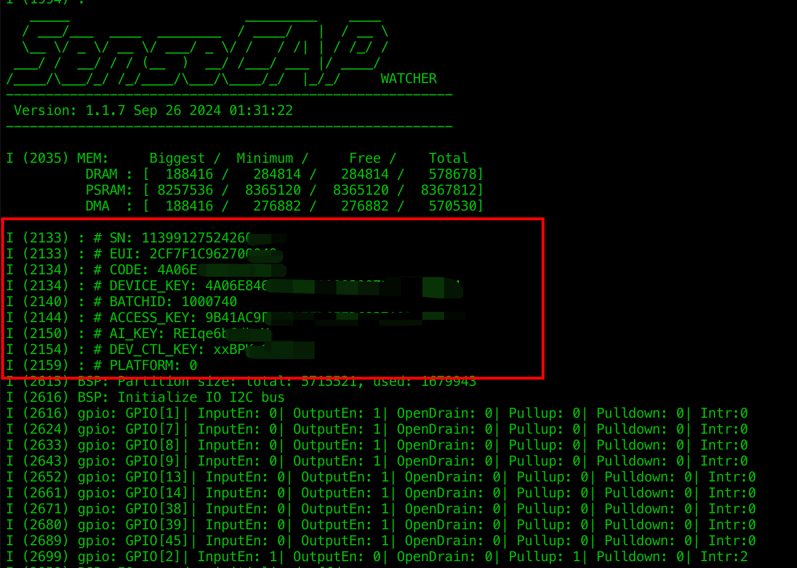

SenseCAP Watcher source repository address:

```
https://github.com/Seeed-Studio/SenseCAP-Watcher-Firmware
```

SenseCAP Watcher Latest Firmware source code:

```
https://github.com/Seeed-Studio/SenseCAP-Watcher-Firmware/tree/main/examples/factory_firmware
```

Himax AI Chip source repository address:

```
https://github.com/Seeed-Studio/sscma-example-we2/
```

## Flash Firmware

When you download the firmware for SenseCAP Watcher, you will notice that it comes with two different firmwares, so keep an eye out for the distinction.

1. ESP32 Firmware

2. Himax Firmware

### For ESP32 Firmware

**Please be especially careful with the partition address of the flash firmware to avoid incorrectly erasing the SenseCAP Watcher's own device information (EUI, etc.), otherwise the device may not be able to connect to the SenseCraft server properly! Please make a note of the necessary information about the device before flashing the firmware to ensure that there is a way to recover it!**

You will see these messages when the device is powered up and switched on.

<div align="center">

</div><br>

**Please also keep your information about these devices safe to avoid losing them!**

If you are using Linux/MacOS, you can flash Watcher's firmware using the command line.

You can use the following two commands to complete the ESP32 firmware flash.

```
pip3 install --upgrade esptool
 
esptool.py --chip esp32s3 -b 2000000 --before default_reset --after hard_reset write_flash --flash_mode dio --flash_size 32MB --flash_freq 80m 0x0 bootloader/bootloader.bin 0x8000 partition_table/partition-table.bin 0x10d000 ota_data_initial.bin 0x110000 factory_firmware.bin 0x1910000 srmodels/srmodels.bin 0x1a10000 storage.bin
```

If you are using Windows, you can use [esptool](https://www.espressif.com/sites/default/files/tools/flash_download_tool_3.9.6.zip).

You will need to flash 5 firmware for the SenseCAP Watcher and you will find two serial ports (one for esp32, another for himax) when the Watcher is connected to the computer. **The serial port for flash memory could be any of these**.

Open esptool and select the MCU model:

<div align="center">

</div><br>

Follow the diagram below to enter the correct address and select the correct firmware.

<div align="center">

</div><br>

**If you find that there is no progress when flashing, then the wrong flash serial port may be selected and you may need to switch to another one.**

### For Himax Firmware

**We do not recommend that any user make any kind of modifications to the Himax firmware. The methods we provide are limited to use for restoring the firmware in special cases.**

Next, you need to switch to another serial port, which is the serial port of the Himax chip, please operate the Himax chip under this serial port.

Make sure your Python version is above 3.8.

Execute the following commands to install python-sscma and finish burning the firmware and model. Models only support model files that are supported in SenseCraft AI.

```
pip3 install python-sscma

sscma.cli flasher -f firmware.img
```

## Quick Build SenseCAP Watcher ESP32's Firmware

SenseCAP Watcher source repository address:

```
https://github.com/Seeed-Studio/SenseCAP-Watcher-Firmware
```

The project provides basic SDK for the SenseCAP Watcher, as well as the examples for getting started. It is based on the [ESP-IDF](https://github.com/espressif/esp-idf).

### Getting Started

#### Install ESP IDF

Follow instructions in this guide
[ESP-IDF - Get Started](https://docs.espressif.com/projects/esp-idf/en/latest/get-started/index.html)
to setup the built toolchain used by SSCMA examples. Currently we're using the latest version `v5.1`.

#### Clone and Setup the Repository

1. Clone our repository.

    ```sh
    git clone https://github.com/Seeed-Studio/SenseCAP-Watcher
    ```

2. Go to `SenseCAP-Watcher` folder.

    ```sh
    cd SenseCAP-Watcher
    ```

3. Fetch the submodules.

    ```sh
    git submodule update --init
    ```

#### Build and Run Examples

1. Go to examples folder and list all available examples.

    ```sh
    cd examples && \
    ls
    ```

2. Choose a `factory_firmware` and enter its folder.

    ```sh
    cd factory_firmware
    ```

3. Generate build config using ESP-IDF.

    ```sh
    # set build target
    idf.py set-target esp32s3
    ```

4. Build the demo firmware.

    ```sh
    idf.py build
    ```

5. Flash the demo firmware to device and Run.

    To flash (the target serial port may vary depend on your operating system, please replace `/dev/ttyACM0` with your device serial port).

    ```
    idf.py --port /dev/ttyACM0 flash
    ```

    Monitor the serial output.

    ```
    idf.py --port /dev/ttyACM0 monitor
    ```

##### Tip

- Use `Ctrl+]` to exit monitor.

- The previous two commands can be combined.

    ```sh
    idf.py --port /dev/ttyACM0 flash monitor
    ```


