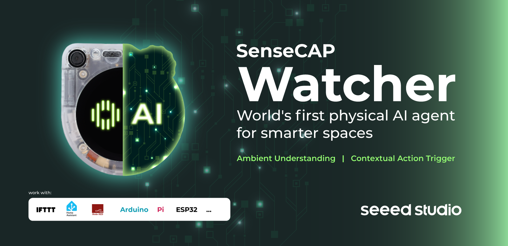
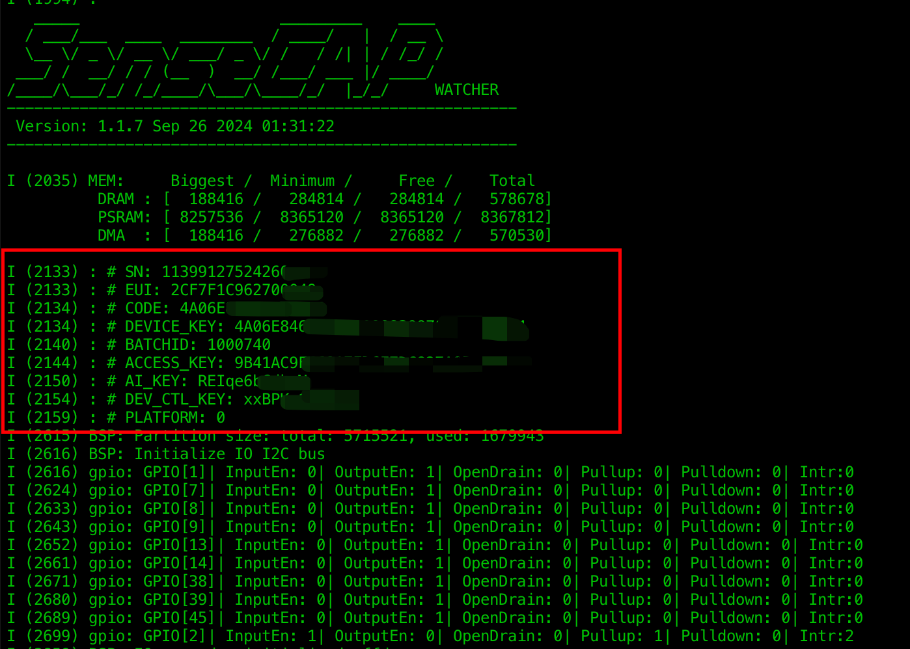
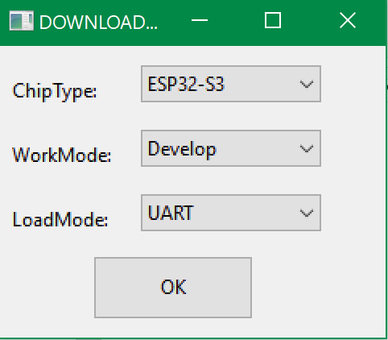
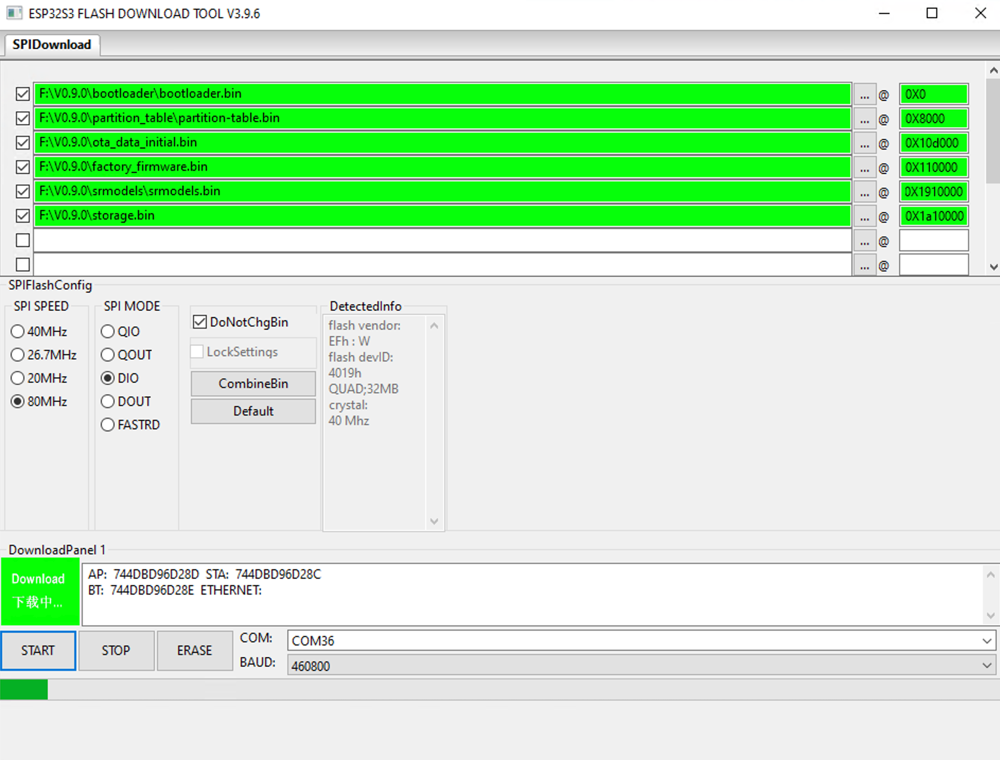

<h1 align="center">SenseCAP Watcher</h1>

 </img>

<div align="center">
<a href="https://discord.gg/jGWQStEvEp"></a>
<a href="https://x.com/seeedstudio" > </a>
<br>
<a href="https://www.reddit.com/r/Seeed_Studio/submit/?type=TEXT" target="_blank"></a>&nbsp;
<a href="https://www.linkedin.com/shareArticle?mini=true&url=https%3A//github.com/Seeed-Studio/OSHW-SenseCAP-Watcher" target="_blank"></a>&nbsp;
<a href="https://www.facebook.com/sharer/sharer.php?u=https%3A//github.com/Seeed-Studio/OSHW-SenseCAP-Watcher" target="_blank"></a>&nbsp;
<a href="https://t.me/share/url?text=Awesome%20communication%20engine!&url=https%3A%2F%2Fgithub.com%2FSeeed-Studio%2FOSHW-SenseCAP-Watcher" target="_blank"></a>&nbsp;
<a href="https://wa.me/?text=Awesome%20communication%20engine!%5Cn%20https%3A%2F%2Fgithub.com%2FSeeed-Studio%2FOSHW-SenseCAP-Watcher" target="_blank"></a>&nbsp;
<a href="mailto:?subject=Awesome%20Physical%20AI%20Agent&body=Checkout%20this%20awesome%20physical%20ai%20agent%3A%0Ahttps%3A//github.com/Seeed-Studio/OSHW-SenseCAP-Watcher" target="_blank"></a>
<br>
<a href="https://github.com/Seeed-Studio/OSHW-SenseCAP-Watcher/stargazers"></a>
<a href="https://github.com/Seeed-Studio/OSHW-SenseCAP-Watcher/network/members"></a>
<a href="https://github.com/Seeed-Studio/OSHW-SenseCAP-Watcher/pulls"></a>
<a href="https://github.com/Seeed-Studio/OSHW-SenseCAP-Watcher/issues"></a>
<a href="https://github.com/Seeed-Studio/OSHW-SenseCAP-Watcher/graphs/contributors"></a>
<a href="https://github.com/Seeed-Studio/OSHW-SenseCAP-Watcher/blob/main/LICENSE"></a>

</div>

## Introduction

SenseCAP Watcher is built on ESP32S3, incorporating a Himax WiseEye2 HX6538 AI chip with Arm Cortex-M55 & Ethos-U55, excelling in image and vector data processing. Equipped with a camera, microphone, speaker, SenseCAP Watcher can see, hear, talk. Plus, with LLM-enabled SenseCraft suite, SenseCAP Watcher understands your commands, perceives its surroundings, and triggers actions accordingly.

[](https://www.youtube.com/watch?v=ny22Z0cAIqE)

## Table of Open Source Material

- [📁 Firmwave](./Firmware/): Watcher's factory firmware, project code.

- [📁 Hardware](./Hardware/): Open source hardware documentation available for Watcher.

    -[📎 SenseCAP Watcher v1.0 Schematic](./Hardware/SenseCAP_Watcher_v1.0_SCH.pdf)

    -[📎Espressif ESP32-S3 Datasheet](./Hardware/esp32-s3_datasheet.pdf)

    -[📎Himax HX6538-A Datasheet](./Hardware/HX6538_datasheet.pdf)

- [📁 Documentation](./Documentation/): All Wiki documents about Watcher.

## SenseCAP Watcher Quick Start Guide

### Must-Do

Before using Watcher as a space assistant, we must ensure that the following three steps are performed successfully, which is the basis for all subsequent steps.

#### Step 1. Installation Packaging

The Watcher comes with a unique packaging that doubles as a stylish, calendar-like stand. By placing the Watcher inside this stand, you can create an attractive decoration for your home. Follow the step-by-step instructions below and refer to the accompanying video for a visual guide on how to install your Watcher in its stand.

https://files.seeedstudio.com/wiki/watcher_getting_started/watcher-packaging.mp4

#### Step 2. Power On

To power on your Watcher device, press and hold the wheel button located on the upper right corner for approximately 3 seconds until the Seeed Studio logo appears on the screen.

<div align="center">

</div>

Once the logo is displayed, release the button and allow the device to complete its initialization process. After a few moments, the Watcher will display its main menu, indicating that it is ready for use.

**If the device won't turn on with a long press, the device may be low on power and you may need to connect a cable to power it up before you can wake up the Watcher.**

#### Step 3. Device Binding

**[SenseCraft Pro](https://wiki.seeedstudio.com/watcher_price/) will automatically activate the trial service when your device is tethered to the SenseCraft APP.**

After powering on your Watcher, if it has not been previously bound to a device, it will prompt you to connect to the SenseCraft app. Alternatively, you can find the "Connect to APP" option in the Settings menu. The Watcher will then display a QR code to download the SenseCraft app.

You can either scan the QR code or use the provided link to download the app.

<div align="center">
    <a href="https://sensecraft-app-download.seeed.cc">
        <strong><span>Download APP 🖱️</span></strong>
    </a>
</div>

<br />

To proceed with binding your Watcher to the SenseCraft app, follow these steps:

**1.** On your Watcher, rotate the wheel button clockwise to enter the QR code interface for binding the device.

<div align="center">

</div>

**2.** Open the SenseCraft app on your mobile device and tap the plus sign (+) in the top right corner to add your Watcher by scanning the QR code.

**Ensure that your mobile device's Bluetooth permissions are enabled, as the binding process requires a Bluetooth connection.**

<div align="center">

</div>

**3.** After successfully scanning the QR code, the app will navigate to the network configuration page. Select a 2.4GHz Wi-Fi network to connect your Watcher to the internet.

<div align="center">

</div>

Tap the "Next" button to proceed.

**4.** Choose a name for your Watcher and select an appropriate group for it.

<div align="center">

</div>

Tap the "Finish" button to complete the setup process.

**5.** The SenseCraft app will display a tutorial page, providing guidance on how to use your Watcher. Take a moment to familiarize yourself with the instructions.

<div align="center">

</div>

Once the setup is complete, the app will open a chat window to communicate with your Watcher, while the Watcher will return to its main menu.

With the binding process finished, your Watcher is now connected to the SenseCraft app, and you can start exploring its features and capabilities. The app serves as a convenient way to interact with your Watcher, adjust settings, and receive notifications remotely.

### Schedule a task for Watcher

Next, select the method you want to use to schedule an executable task for Watcher.

#### Built-in task templates

To run a task from the Task Templates on your Watcher, follow these steps:

**1.** From the main menu, use the wheel button to navigate to the **Task Templates** option.

**2.** Press the wheel button to enter the Task Templates submenu.

**3.** Scroll through the available task templates using the wheel button until you find the desired model task.

**4.** Press the wheel button to select and start running the chosen task.

<div align="center">

</div>

Once the task begins, the Watcher will display an animated emoji face on the screen. This emoji indicates that the device is actively monitoring for the target object specified by the selected task template.

When the Watcher detects the target object, the display will switch from the emoji animation to a real-time view of the detected object. This allows you to see what the Watcher has identified.

If the target object moves out of the Watcher's view or is no longer detected, the display will automatically return to the animated emoji face, signifying that the device is still monitoring for the target.

Task Templates:

- Human Detection:

   - This task template is designed to detect the presence of human beings.

   - When the Watcher identifies a **person**, it will trigger an alarm notification.

<div align="center">

</div>

- Pet Detection:

   - The Pet Detection task template focuses on recognizing cats or dogs.

   - If the Watcher detects a **cat**, it will trigger an alarm notification.

<div align="center">

</div>

- Gesture Detection:

   - This task template is configured to identify the "paper" hand gesture.

   - When the Watcher recognizes the **paper gesture**, it will trigger an alarm notification.

<div align="center">

</div>

Each of these task templates has specific alarm triggering conditions based on the detection of their respective targets: humans, cats, or the paper gesture. By using these templates, you can quickly set up the Watcher to monitor for the desired object without the need for extensive configuration.

#### Through the APP

**Fees may apply for using some of SenseCraft AI's services, please refer to the documentation below for details: [SenseCraft AI for Watcher Plans and Benefits](https://wiki.seeedstudio.com/watcher_price/)**

The SenseCraft APP allows you to send Tasks to your Watcher device. In this example, we will demonstrate the process of sending a task using one of the sample tasks provided by Watcher. Let's use the command *If you see a candles, please notify me*.

**1.** Open the SenseCraft APP and navigate to the chat window for your connected Watcher device.

<div align="center">

</div>

**2.** In the chat window, either select the desired task from the available options or manually type in the command *If you see a candles, please notify me*. Send the command to your Watcher by tapping the send button or pressing enter.

**3.** Upon receiving the command, Watcher will interpret it and break it down into a task flow consisting of **When**, **Do**, and **Capture Frequency** components.

<div align="center">

</div>

Review the parsed task flow to ensure that Watcher has correctly understood your command. The app will display the interpreted task details for your verification. If any part of the task flow does not align with your intended command, you can modify the task details by accessing the **Detail Config** section within the app.

<div align="center">

</div>

**4.** Once you have confirmed or adjusted the task details, click the **Run** button to send the finalized task to your Watcher.

Watcher will download the task instructions, and once the download is complete, it will transform into a vigilant monitoring system, ready to detect any instances of candles.

<div align="center">

</div>

**5.** If Watcher identifies a candles, it will send an alert based on the predefined settings, which may include flashing lights, audible alarms, and notifications through the SenseCraft APP.

<div align="center">

</div>


**Please note that due to the time constraints of the task flow, there will be a minimum interval between consecutive alerts to avoid excessive notifications**.

By following these steps, you can effectively send commands to your Watcher using the SenseCraft APP, enabling it to perform specific monitoring tasks and notify you when the specified conditions are met.

Remember to regularly review and adjust your Watcher's settings and task flows to ensure optimal performance and alignment with your monitoring requirements. For a more detailed description and explanation of the APP's tasks and options, as well as a detailed description of the intervals, please read **[Watcher Task Assignment Guideline](https://wiki.seeedstudio.com/getting_started_with_watcher_task/)** to learn more.

#### By Voice

**Fees may apply for using some of SenseCraft AI's services, please refer to the documentation below for details: [SenseCraft AI for Watcher Plans and Benefits](https://wiki.seeedstudio.com/watcher_price/)**

The Watcher offers a convenient and intuitive way to send tasks or engage in conversation using voice commands, thanks to its "Push to Talk" feature. This functionality is accessible from any screen or interface on the device, making it easy to interact with the Watcher without navigating through menus. Here's a step-by-step guide on how to use this feature:

1. Activate Push to Talk:

   - Locate the Wheel Button on the top-right corner of the Watcher.
   - Press and hold the Wheel Button to enter the voice input interface.

<div align="center">

</div>

2. Speak Your Command or Message:

   - While holding the Wheel Button, clearly speak your task or message to the Watcher.
   - You can assign tasks, such as "Tell me if the baby is crying" or "If the dog is stealing food, say stop Copper". (Copper is the name of my dog.)

3. Release the Wheel Button:

   - Once you have finished speaking, release the Wheel Button.
   - The Watcher will process your voice input and determine whether it is a task assignment.

4. Task Assignment:

   - If the Watcher recognizes your voice input as a task assignment, it will automatically break down your task into relevant components.
   - The Watcher will display cards on its screen, showing the **Object** (what to monitor), **Behavior** (what action to look for), **Notification** (how to alert you), **Time Range** (when to monitor), and **Frequency** (how often to monitor).
   - Review the displayed information to ensure it accurately represents your intended task.
   - If the details are correct, confirm the task, and the Watcher will begin executing it according to the specified parameters.
   - If Watcher misunderstands your task, long press the scroll wheel button and you can continue through the dialogue to try to correct Watcher's understanding of the task. If you still can't understand it correctly after several attempts, we recommend that you use the SenseCraft APP to place the task.

<div align="center">

</div>

Tips for Optimal Usage:

- Speak clearly and at a moderate pace to ensure accurate voice recognition.
- When speaking, please get as close to Watcher as possible, about **3 ~ 10cm** distance speaking recognition accuracy is best.
- Minimize background noise to improve the Watcher's ability to understand your voice commands.
- Be specific and concise when assigning tasks to help the Watcher accurately interpret your intentions.

By leveraging the Push to Talk feature, you can effortlessly send tasks and engage in conversations with the Watcher, making your interaction with the device more natural and efficient.

**If you encounter an error of **0x7002**, it means that the current Watcher's network status is not good and the audio service call failed, please change the network or location and retry again.**


### To end a running task

1. Tap the screen once or press the wheel button.

2. A confirmation popup will appear with two options: **Main Menu** and **End Task**. To terminate the task, either tap **End Task** on the screen or use the scroll wheel to navigate to "End Task" and press the scroll wheel button to confirm.

<div align="center">

</div>

3. Alternatively, you can end the task via the SenseCraft APP on your mobile device by pressing the **End** button on the task card.

<div align="center">

</div>


## Flash Firmware

When you download the firmware for SenseCAP Watcher, you will notice that it comes with two different firmwares, so keep an eye out for the distinction.

1. ESP32 Firmware

2. Himax Firmware

### For ESP32 Firmware

**Please be especially careful with the partition address of the flash firmware to avoid incorrectly erasing the SenseCAP Watcher's own device information (EUI, etc.), otherwise the device may not be able to connect to the SenseCraft server properly! Please make a note of the necessary information about the device before flashing the firmware to ensure that there is a way to recover it!**

You will see these messages when the device is powered up and switched on.

<div align="center">

</div><br>

**Please also keep your information about these devices safe to avoid losing them!**

If you are using Linux/MacOS, you can flash Watcher's firmware using the command line.

You can use the following two commands to complete the ESP32 firmware flash.

```
pip3 install --upgrade esptool
 
esptool.py --chip esp32s3 -b 2000000 --before default_reset --after hard_reset write_flash --flash_mode dio --flash_size 32MB --flash_freq 80m 0x0 bootloader/bootloader.bin 0x8000 partition_table/partition-table.bin 0x10d000 ota_data_initial.bin 0x110000 factory_firmware.bin 0x1910000 srmodels/srmodels.bin 0x1a10000 storage.bin
```

If you are using Windows, you can use [esptool](https://www.espressif.com/sites/default/files/tools/flash_download_tool_3.9.6.zip).

You will need to flash 5 firmware for the SenseCAP Watcher and you will find two serial ports (one for esp32, another for himax) when the Watcher is connected to the computer. **The serial port for flash memory could be any of these**.

Open esptool and select the MCU model:

<div align="center">

</div><br>

Follow the diagram below to enter the correct address and select the correct firmware.

<div align="center">

</div><br>

**If you find that there is no progress when flashing, then the wrong flash serial port may be selected and you may need to switch to another one.**

### For Himax Firmware

**We do not recommend that any user make any kind of modifications to the Himax firmware. The methods we provide are limited to use for restoring the firmware in special cases.**

Next, you need to switch to another serial port, which is the serial port of the Himax chip, please operate the Himax chip under this serial port.

Make sure your Python version is above 3.8.

Execute the following commands to install python-sscma and finish burning the firmware and model. Models only support model files that are supported in SenseCraft AI.

```
pip3 install python-sscma

sscma.cli flasher -f firmware.img
```


## Quick Build SenseCAP Watcher ESP32's Firmware

SenseCAP Watcher source repository address:

```
https://github.com/Seeed-Studio/SenseCAP-Watcher-Firmware
```

The project provides basic SDK for the SenseCAP Watcher, as well as the examples for getting started. It is based on the [ESP-IDF](https://github.com/espressif/esp-idf).

### Getting Started

#### Install ESP IDF

Follow instructions in this guide
[ESP-IDF - Get Started](https://docs.espressif.com/projects/esp-idf/en/latest/get-started/index.html)
to setup the built toolchain used by SSCMA examples. Currently we're using the latest version `v5.1`.

#### Clone and Setup the Repository

1. Clone our repository.

    ```sh
    git clone https://github.com/Seeed-Studio/SenseCAP-Watcher
    ```

2. Go to `SenseCAP-Watcher` folder.

    ```sh
    cd SenseCAP-Watcher
    ```

3. Fetch the submodules.

    ```sh
    git submodule update --init
    ```

#### Build and Run Examples

1. Go to examples folder and list all available examples.

    ```sh
    cd examples && \
    ls
    ```

2. Choose a `factory_firmware` and enter its folder.

    ```sh
    cd factory_firmware
    ```

3. Generate build config using ESP-IDF.

    ```sh
    # set build target
    idf.py set-target esp32s3
    ```

4. Build the demo firmware.

    ```sh
    idf.py build
    ```

5. Flash the demo firmware to device and Run.

    To flash (the target serial port may vary depend on your operating system, please replace `/dev/ttyACM0` with your device serial port).

    ```
    idf.py --port /dev/ttyACM0 flash
    ```

    Monitor the serial output.

    ```
    idf.py --port /dev/ttyACM0 monitor
    ```

##### Tip

- Use `Ctrl+]` to exit monitor.

- The previous two commands can be combined.

    ```sh
    idf.py --port /dev/ttyACM0 flash monitor
    ```

## Table of Wiki Documentation

Introducing the Watcher Product Catalogue, your comprehensive guide to setting up, using, and maintaining your Watcher device. Discover the key features, customization options, and mounting possibilities that make Watcher the perfect monitoring solution. With detailed instructions, troubleshooting tips, and specifications, this catalogue empowers you to fully utilize your Watcher and experience peace of mind through advanced surveillance technology.

<div align="center">

</div>

- [Quick start guide](https://wiki.seeedstudio.com/getting_started_with_watcher/)

- [Price and benefits](https://wiki.seeedstudio.com/watcher_price/)

- [Product Overview](http://wiki.seeedstudio.com/product_overview_with_watcher/)

    - [Hardware Overview](http://wiki.seeedstudio.com/watcher_hardware_overview/)

    - [Operation Guideline](http://wiki.seeedstudio.com/watcher_operation_guideline/)

    - [Task Assignment Guideline](http://wiki.seeedstudio.com/getting_started_with_watcher_task/)

- [Software Framework Overview](http://wiki.seeedstudio.com/watcher_software_framework_overview/)

    - [SenseCraft APP Introduction](http://wiki.seeedstudio.com/sensecap_app_introduction/)

    - [Watcher Software Service Introduction](http://wiki.seeedstudio.com/watcher_software_service_framework/)

    - [Deploy Watcher's AI Capabilities Locally](http://wiki.seeedstudio.com/watcher_local_deploy/)

- [Notification](http://wiki.seeedstudio.com/notifications_with_watcher_main_page/)

    - [UART Output](http://wiki.seeedstudio.com/uart_output/)

    - [HTTP Proxy Notification](http://wiki.seeedstudio.com/http_proxy_notification/)

        - [Smart Home](http://wiki.seeedstudio.com/smart_main_page/)

            - [Integrate Watcher to Home Assistant](http://wiki.seeedstudio.com/integrate_watcher_to_ha/)

        - [Node-RED Integration](http://wiki.seeedstudio.com/notification_with_watcher/)

            - [Watcher to Node-RED](http://wiki.seeedstudio.com/watcher_to_node_red/)

            - [Watcher & Node-RED to IFTTT](http://wiki.seeedstudio.com/watcher_node_red_to_ifttt/)

            - [Watcher & Node-RED to Kafka](http://wiki.seeedstudio.com/watcher_node_red_to_kafka/)

            - [Watcher & Node-RED to Open Interpreter](http://wiki.seeedstudio.com/watcher_node_red_to_open_interpreter/)

            - [Watcher & Node-RED to P5JS](http://wiki.seeedstudio.com/watcher_node_red_to_p5js/)

            - [Watcher & Node-RED to Telegram](http://wiki.seeedstudio.com/watcher_node_red_to_telegram/)

            - [Watcher & Node-RED to Twilio](http://wiki.seeedstudio.com/watcher_node_red_to_twilio/)

            - [Watcher & Node-RED to Discord](http://wiki.seeedstudio.com/watcher_node_red_to_discord/)

            - [Watcher & Node-RED to MongoDB](http://wiki.seeedstudio.com/watcher_node_red_to_mongodb/)

            - [Watcher & Node-RED to WhatsApp](http://wiki.seeedstudio.com/watcher_node_red_to_whatsapp/)

- [Application](http://wiki.seeedstudio.com/applications_with_watcher_main_page/)

    - [Use Case](http://wiki.seeedstudio.com/use_case/)

    - [Development](http://wiki.seeedstudio.com/development/)

        - [Traning Model For Watcher](http://wiki.seeedstudio.com/training_model_for_watcher/)


## License

This project is licensed under the Apache License, Version 2.0 (the "License");

You may not use this file except in compliance with the License.

You may obtain a copy of the License at

    http://www.apache.org/licenses/LICENSE-2.0

Unless required by applicable law or agreed to in writing, software
distributed under the License is distributed on an "AS IS" BASIS,
WITHOUT WARRANTIES OR CONDITIONS OF ANY KIND, either express or implied.

See the License for the specific language governing permissions and limitations under the License.

Please see the [LICENSE](./LICENSE) file for more details.

---

## Thank you all!](#thank-you)

Special thanks to all contributors and supporters that starred this repository.

**Our amazing contributors**:

<a href="https://github.com/Seeed-Studio/OSHW-SenseCAP-Watcher/graphs/contributors">
  
</a><br><br><br>

Do you like this project? Please join us or [give](https://github.com/Seeed-Studio/OSHW-SenseCAP-Watcher) a ⭐. This will help to attract more contributors.

Do you have an idea or found a bug? Please open an [issue](https://github.com/Seeed-Studio/OSHW-SenseCAP-Watcher/issues/new/choose) or start a [discussion](https://github.com/Seeed-Studio/OSHW-SenseCAP-Watcher/discussions).


**Follow us** at<br />

<a href="https://discord.gg/jGWQStEvEp"></a>
<a href="https://x.com/seeedstudio" > </a>
[](https://www.linkedin.com/company/seeedstudio/)


<div align="right">[ <a href="#introduction">↑ Back to top ↑</a> ]</div>

---
